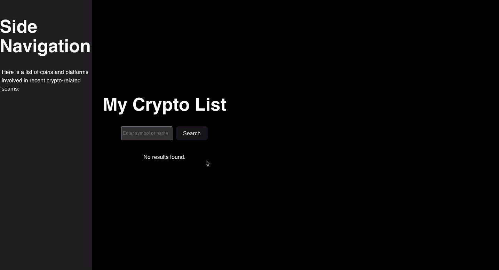

# Web Development Project 1 - Crypto Hustle Lite

Submitted by: **James Levi**

This web app: **A simple crypto tracker that allows users to search for cryptocurrency prices and view recent crypto-related scams.**

Time spent: **15** hours spent in total

## Required Features

The following **required** functionality is completed:

- [x] **User can view a list of at least 30 cryptocurrencies, including the image, name, and price of the coin in US dollars**
- [x] **User can search for a specific coin in the list of cryptocurrencies by symbol**

The following **optional** features are implemented:

- [x] **User can view a list of cryptocurrency scams on a separate pane in the page**
- [x] **There is clear separation between the main content area and the sidebar to ensure no overlap**
- [x] **The search functionality includes loading and error states to improve user experience**

The following **additional** features are implemented:

- [x] Improved error handling for the CryptoScam API to display more meaningful messages in case of network issues
- [x] Enhanced search behavior to ensure the search only triggers on a button click for better performance control
- [x] The scam list displays a fallback message if no scam data is available or the endpoint is blocked

## Video Walkthrough

Here's a walkthrough of implemented required features:

  

GIF created with [ScreenToGif](https://www.screentogif.com/) for Windows.

## Notes

Challenges encountered while building the app:

- Integrating the CryptoScam API and ensuring data displayed correctly was challenging due to endpoint reliability issues. The fix involved adding improved error handling and fallback messages.
- Implementing the search functionality required restructuring the logic to ensure the search only occurs after the user clicks the “Search” button.
- Ensuring the layout was responsive and did not overlap with the sidebar required adjusting CSS properties for proper spacing.

## License

    Copyright 2025 James Levi

    Licensed under the Apache License, Version 2.0 (the "License");
    you may not use this file except in compliance with the License.
    You may obtain a copy of the License at

        http://www.apache.org/licenses/LICENSE-2.0

    Unless required by applicable law or agreed to in writing, software
    distributed under the License is distributed on an "AS IS" BASIS,
    WITHOUT WARRANTIES OR CONDITIONS OF ANY KIND, either express or implied.
    See the License for the specific language governing permissions and
    limitations under the License.